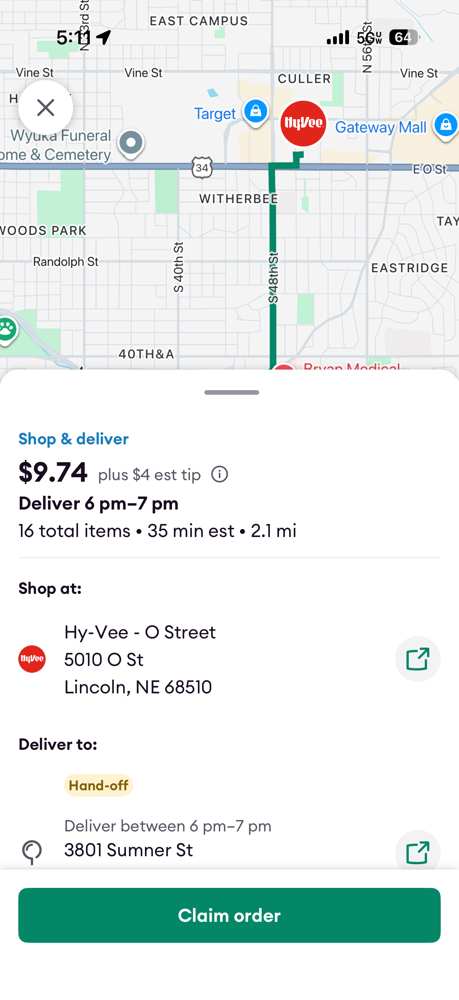
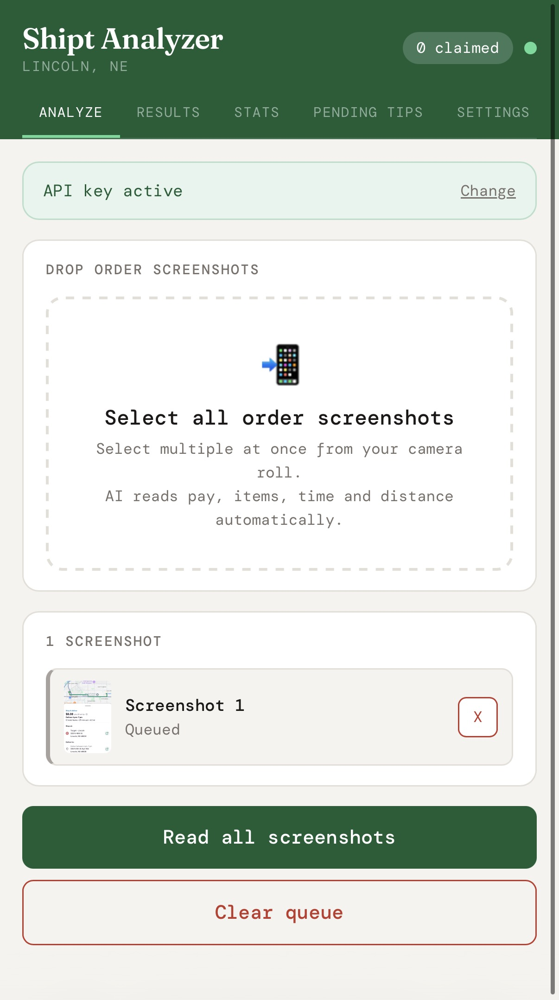
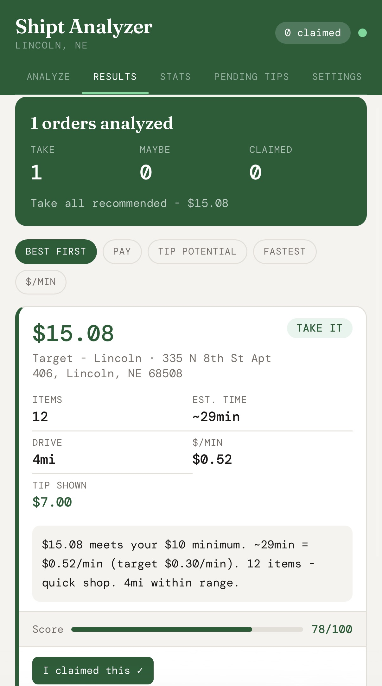
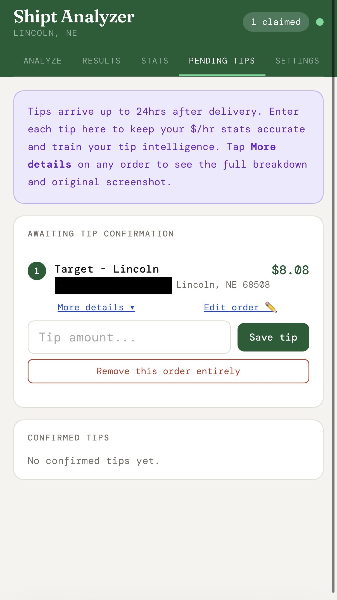
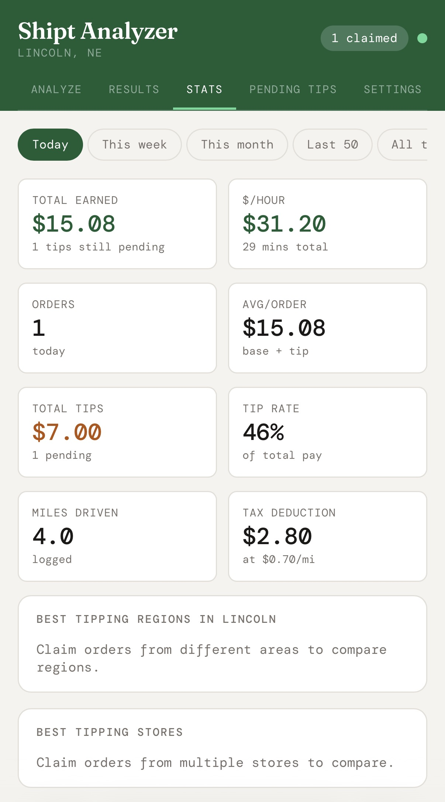
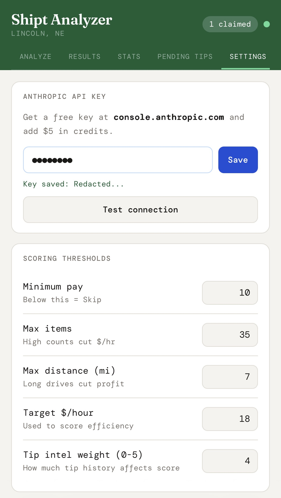
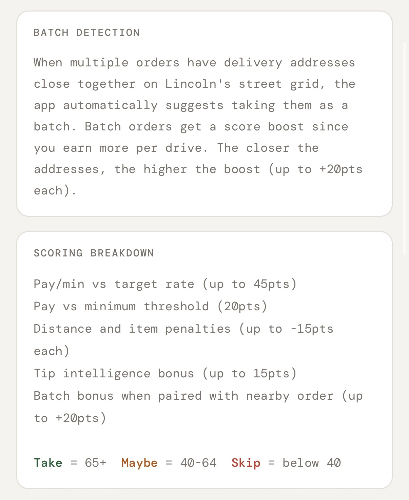
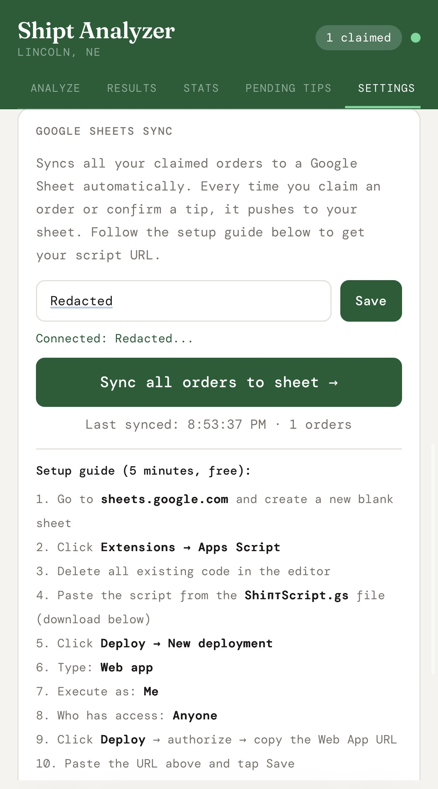

# Shipt Analyzer: A Portfolio Case Study

---

### **Executive Summary**

This document details a web application I built to optimize my profitability as a Shipt shopper. The tool uses the Anthropic Claude API to analyze order screenshots, applies a custom scoring algorithm to rank opportunities based on their true hourly pay rate, and uses historical data to predict tips. The project demonstrates a full workflow from raw data input to intelligent, data-driven decision-making.

**Key Features:**
*   **AI-Powered Data Extraction:** Uses an LLM to read and structure data from raw images.
*   **Customizable Scoring Algorithm:** Moves beyond simple pay to calculate an effective hourly rate.
*   **"Tip Intelligence":** Learns from past order data to favor historically high-tipping jobs.
*   **Intelligent Batching:** Identifies cost-saving, custom batch opportunities using a grid map instead of a paid API.
*   **Persistent Data Backend:** Offloads data to Google Sheets for scalable, long-term analysis.

**Challenges I Solved:**
*   **Refined a Naive Algorithm:** Evolved a basic scoring system into a strategic, configurable engine.
*   **Re-architected for Scale:** Migrated data storage from fragile browser local storage to a robust Google Sheets database.

---

## 1. The Problem: Maximizing Profitability in the Gig Economy

As a Shipt shopper, the goal is to maximize profits. However, profitability isn't as simple as just accepting the highest-paying orders. True efficiency comes from calculating the pay rate relative to the time commitment, or dollars per hour. Manually calculating this for every potential order—while factoring in variables like distance, number of items, and potential tips—is time-consuming and prone to error, especially when good orders are claimed in seconds.

After tracking my first 10-15 orders, I discovered a critical insight: tips accounted for nearly 50% of my total income. This meant that simply chasing high base pay was an incomplete strategy. To truly maximize profits, I needed a tool that not only calculated efficiency but also learned and prioritized orders with a higher probability of a good tip.

## 2. What I Built: A Smart Order Analysis & Decision Engine
To solve this, I built a standalone web application that serves as a personal mission control for Shipt shopping. The workflow is simple: I take screenshots of available orders from the Shipt app and upload them to the analyzer. The tool then processes the images and presents a clear, data-driven recommendation for each one.

Once an order is analyzed, the workflow continues within the app. I can mark an order as "Claimed," which automatically moves it to a "Pending Tips" tab. This section serves as a queue for completed orders where the final tip, which can arrive days or weeks later, has not yet been logged. The system also allows for manual data correction at any stage. This is crucial for fixing occasional text recognition errors from the image analysis, such as distinguishing between two locations of the same store (e.g., ensuring "Target" is correctly logged as "Target South"). This ensures the data feeding the Tip Intelligence feature is as accurate as possible.

The application is a single HTML file with vanilla JavaScript, making it fast, portable, and easy to maintain. It uses the browser's local storage for settings and syncs completed order data to Google Sheets for long-term analysis.

**Key Features:**

*   **AI-Powered Data Extraction:** The tool uses the Anthropic Claude API to read text from the screenshots, instantly converting unstructured image data into structured information (pay, items, time, distance).

*   **Custom Scoring Algorithm:** Each order is graded on a 100-point scale based on a custom formula that prioritizes the effective hourly rate. The result is a simple, color-coded verdict: **Take** (high value), **Maybe** (moderate value), or **Skip** (low value).

*   **Intelligent Batching:** To avoid paying for a maps API, I created a custom grid map of my shopping area (Lincoln, NE). The analyzer uses this to identify when two separate orders are close enough to be batched together, suggesting custom, high-efficiency bat
markdownches that the official app might miss.

*   **Tip Intelligence:** The app learns from past performance. After completing an order, I can log the final tip amount. The analyzer uses this historical data, synced to Google Sheets, to add bonus points to future orders from historically high-tipping stores or neighborhoods, further optimizing my decision-making.

*   **Persistent Data & Dashboarding:** All claimed order data, including tips and bonuses, is saved to a Google Sheet. This creates a personal database that feeds the "Stats" tab in the analyzer, providing at-a-glance KPIs on my performance over time.

## 3. Proof: The Workflow in Action

The process is designed to be fast and efficient, turning raw screenshots into actionable recommendations in seconds.

### Step 1: Raw Input

First, I capture screenshots of the available orders directly from the Shipt app.

  

### Step 2: Upload

Next, I drop the raw screenshots into the analyzer's upload area.

  

### Step 3: Analysis & Recommendation

The tool calls the Claude API to parse the images and then runs the data through the scoring algorithm. The results are displayed as neatly organized cards with clear "Take," "Maybe," or "Skip" verdicts.

  

### Step 4: Claim & Track

Once an order is claimed in the app, it moves to the "Pending Tips" tab. This screen tracks completed jobs for which a tip has not yet been received, allowing for easy updates once the final pay is known.

  

### Step 5: Data Tracking

Finally, all completed and updated orders are synced to Google Sheets, and the analyzer's "Stats" tab provides a dashboard view of key performance indicators.

  

## 4. Challenges & How I Solved Them

Building the analyzer involved several iterations and learning opportunities. Two key challenges stood out:

### Challenge 1: Refining the Scoring System

**The Problem:** The initial scoring algorithm was too simplistic and tended to rate most orders as "high value." This was not effective for distinguishing between a good order and a *great* one, as most offers on the platform need to have some base level of appeal to be taken at all.

**The Solution:** I implemented a more sophisticated, user-configurable scoring system. Instead of a rigid formula, I added settings that allowed me to define my personal profitability targets (e.g., minimum pay, max distance, target $/hour). Most importantly, I added a "Tip Intelligence" weight. Based on my finding that tips were 50% of my income, I increased this weight to a 4 out of 5, causing the algorithm to heavily favor orders from stores, neighborhoods, and customers with a proven history of high tips. This transformed the analyzer from a simple calculator into a strategic tool.

*Below are the settings I configured to fine-tune the algorithm and connect the tool's services based on my real-world experience.*

  
   
  <em>Image: The main settings page for connecting to the Claude API and Google Sheets.</em>

  
   
  <em>Image: Updated scoring parameters to reflect a more selective strategy.</em>

  
   
  <em>Image: Settings for the Tip Intelligence and custom Batching features.</em>

### Challenge 2: Scalable Data Storage

**The Problem:** The first version of the analyzer stored all order history in the browser's local storage. I quickly realized this was not a scalable solution. It limited the amount of data that could be saved, made it difficult to access the data for external analysis, and risked data loss if the browser cache was cleared.

**The Solution:** I re-architected the data backend to use Google Sheets. I wrote a simple Google Apps Script that acts as a webhook. Now, when I claim an order in the analyzer, the data is sent to the script and instantly appended as a new row in a designated Google Sheet. This provides a robust, persistent, and easily accessible database for all my order history, allowing for deeper insights and long-term trend analysis directly within the spreadsheet.

## 5. View the Code

The complete code for this single-page application is available on GitHub.

[**dylanbenemerito1/shipt-analyzer**](https://github.com/dylanbenemerito1/shipt-analyzer)
